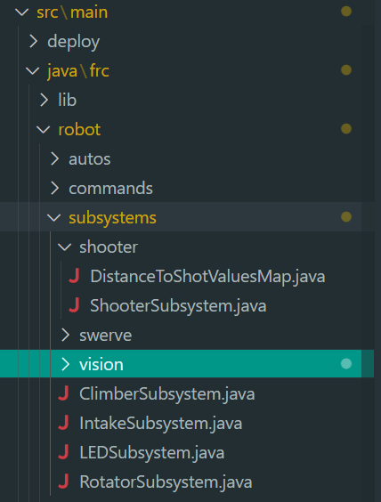

***
## Basic Subsystem Theory

The most basic element in your robot's code is a subsystem. Simply put, a subsystem can be thought of as a collection of all physical robot hardware, such as motors, sensors, servos, etc., which work together in order to accomplish that subsystem's task. 

Some examples of subsystems in 4089's 2024 robot are the shooter, which includes the 2 motors controlling the shooter wheels, the rotator, which includes the motors to control the rotation of the big arm, and the intake, which controls the motor to run the intake rollers. 
 
\[💡] __It is very important to think of how you need to separate the hardware of the robot into different subsystems during the initial code creation. This will be explained more in depth in the [[Commands]]() page, but _most_ of the time, you cannot have two things running on the same subsystem at once, so you don't want to encapsulate too much hardware into one subsystem.__

## Organization

On 4089, we organize all of our subsystems into a subdirectory inside the `robot` folder. If the subsystem contains multiple files that depend on each other, we may further organize those files into another subdirectory, titled something that fits with what the subsystem does.

_Basic example of subsystem organization. Since the `RotatorSubsystem` only contains one file, it is directly inside the `subsystems` directory. The shooter subsystem contains multiple necessary files for its proper function, so it is further organized into the `shooter` subdirectory._

## Code Layout Within a Subsystem
Each subsystem in the robot code is a Java class. This class contains all constants and methods needed to control the robot in the desired way. Often times, you want to tell the subsystem a position to move a mechanism to, or a speed to spin a flywheel at, and the subsystem will handle all the work behind the scenes, so all that is required when using the subsystem is calling a few methods to tell it what you want it to do.
### Constants
At the top is where we like to keep _subsystem specific_ constants, which we name descriptively in `UPPER_SNAKE_CASE`. This lets us know just by reading the variable name that it is a constant, usually numerical value, that is referenced somewhere in the code. If the name can't easily describe what the constant is for, leave a comment above explaining how that number is used. 

\[💡] __It is important to be descriptive with variable names and comment when necessary to help others understand your code. It's hard to debug when nobody knows what does what.__

Constants should also always be private and final, since we don't want to change them (they're __constants__ after all), and since they are subsystem specific, we do not need access to them outside the class. Examples of types of constants we'll define in our code include gear ratios, zero offsets, [[PID]]() gains, [[Motion Profiling]]() constraints, etc. 

### Constructor
The constructor of a subsystem usually contains no arguments, and simply performs any initialization actions that are needed for the subsystem to be in the same state each time the robot is started. This includes applying motor configurations, resetting encoder values, etc. If configuration steps must be applied in multiple places, and there's a lot needed to configure a motor, it's good practice to make an `applyConfigs()` method, or something similar. 

## Methods
In FRC programming, it's ideal to keep as many methods private as possible, especially ones that set power to a motor, or can alter the state of the subsystem in the real world. Things like getter methods can be public, if you need to access information about the subsystem from the outside. This will be dove into more in [[Commands]](), but a subsystem should NEVER have a public `setPower()` method. 

\[💡] __Never make public `setPower()` or similar methods in your subsystem. When at all possible, the only way you should be able to set any sort of motor power from the outside of the class should be through a command.__

Sometimes, private methods that set motor power are necessary for implementing certain functions. If you ever need to set power to a motor, it is recommended you use a voltage control mode, or something similar, as opposed to duty cycle. More info can be found in [[Motors]](). 

